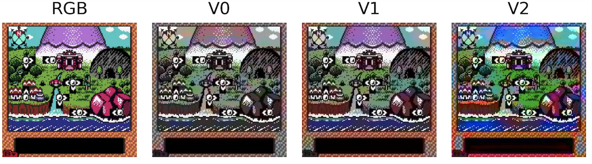

# Colorization of video games’ images using convolutional autoencoders

This repository contains the documentation of my capstone project for **Udacity's Machine Learning Engineer Nanodegree**.

You can also read about the project in my [Medium blog post](https://towardsdatascience.com/image-colorization-using-convolutional-autoencoders-fdabc1cb1dbe).

**Project Overview**

The problem I would like to tackle in this project is quite simple – to colorize grayscale images coming from old-school video games. To do so, I use Deep Learning, in particular, autoencoders based on Convolutional Neural Networks, also known as convolutional autoencoders. 

I use a self-gathered dataset of images coming from a Game Boy Color video game called *Wario Land 3*. Using the provided functions and classes the data set can easily be expanded to include more than one game.

**Structure**

The project was divided into a few steps and I tried to keep them in separate files/Notebooks:

Notebooks:
* `data_preparation.ipynb` - in this Notebook I download the video from YouTube and extract the images to create a data set
* `model_design.ipynb` - in this Notebook I experimented with different architectures of the convolutional autoencoders for image colorization
* `aws_training.ipynb` - this is the Notebook containing the code used for training the models in AWS (as training jobs). It should be run withing the AWS cloud environment.
* `aws_training.ipynb` - this is the Notebook containing the code used for training the models in Google Colab (including links to the data sets).
* `exploring_color_spaces.ipynb` - in this Notebook I experimented with different normalization for the *Lab* color space 

The rest of the Notebooks were used experimentation and contain a brief description inside.

`py` files:
* `dataloaders.py` - contains the custom `DataLoader` for the PyTorch models
* `utils.py` - contains utility functions for moving the files around
* `video_utils.py` - contains the class used for downloading videos from YouTube and extracting the images
* `image_utils.py` - contains various functions for image manipulation
* `dl_utils.py` - contains different convenience functions for Deep Learning models
* `models.py` - contains all the models trained in the project
* `train.py` - contains convenience functions for training and validation of the models

**Results**

Below I present some of the results. for a description of the models, please refer to `capstone_report.pdf`. There, I also briefly describe the results.

Additionally, I applied the models trained on *Wario Land 3* to the preceding installment od the Wario series - *Wario Land 2*. You can see the results below.

**Requirements**

The entire project was carried out in Python (3.6), while training of the convolutional autoencoders was done in PyTorch (1.4). `requirements.txt` contains most of the dependencies required for the project.

The project involved training the NNs using AWS. However, all models can also be trained locally or using Google Colab.

